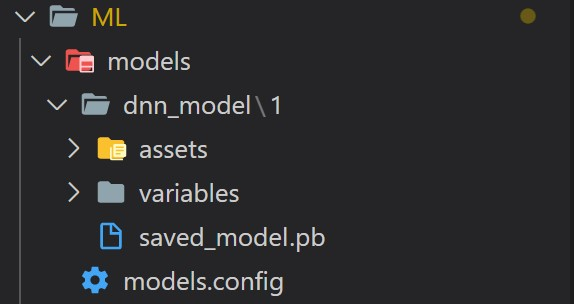
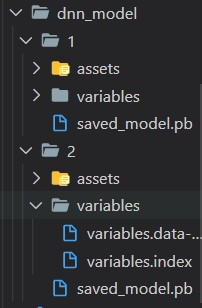

- [Tensorflow serving Quickstart](#tensorflow-serving-quickstart)
  - [Creating the model config file, assets and the tensorserving container](#creating-the-model-config-file-assets-and-the-tensorserving-container)
  - [Testing the deployed container](#testing-the-deployed-container)
  - [Using model versions - Stable vs Canary](#using-model-versions---stable-vs-canary)
  - [Create an Image from a running container](#create-an-image-from-a-running-container)

# Tensorflow serving Quickstart

## Creating the model config file, assets and the tensorserving container

- docker pull tensorflowserving
- command to create a container based on multiple models

`docker run -p 8501:8501 -d --mount type=bind,source=${pwd}/ML/models/dnn_model,target=/models/dnn_model --mount type=bind,source=${pwd}/ML/models/models.config/,target=/models/models.config -t tensorflow/serving --model_config_file=/models/models.config`

- The bind mount maps the local storage to the container storage
- model_config_file is the path of of the model configs
- You need to put your project asset in a folder
- You may give the corresponding project asset a version number
- Create a model config which contains your model name, base_path and model_platform. The model config can serve multiple models. Example of the model config is here

  `model_config_list { config { name: 'saved_model' base_path: '/models/dnn_model/' model_platform: 'tensorflow' } }`

- The project structure should look like the following: 

## Testing the deployed container

- After deploying the model, you can test the model by using the following jupyter notebook commands

```
import requests
import json

data = {"instances": [[8.0, 390.0, 190.0, 3850.0, 8.5, 70.0, 0.0, 0.0, 1.0]]}
payid = json.dumps(data)
url = "http://localhost:8501/v1/models/saved_model/versions/1:predict"

headers = {"content-type": "application/json"}


data = {"instances": [[8.0, 390.0, 190.0, 3850.0, 8.5, 70.0, 0.0, 0.0, 1.0]]}
payid = json.dumps(data)
url = "http://localhost:8501/v1/models/saved_model/versions/1:predict"

headers = {"content-type": "application/json"}

json_response = requests.post(url, data=payid, headers=headers)

json_response.json()

```

## Using model versions - Stable vs Canary

- You can use different model versions and apply a continous model deployment for your system
- For doing that, you need to put the corresponding resources in the right place

  

- Also, you can specify the versions and the deployment policy. You can see the stable and canary versions, so the updated config file looks like the following

```
model_config_list {
config {
name: 'saved_model'
base_path: '/models/dnn_model/'
model_platform: 'tensorflow'
model_version_policy {
specific {
versions: 1
versions: 2
}
}
version_labels {
key: 'stable'
value: 1
}
version_labels {
key: 'canary'
value: 2
}
}

}

```

- To deploy the versionized model, you need to allow version labels for unavailable models so you should use `--allow_version_labels_for_unavailable_models=true` flag. So the docker command looks like the following

  ```
  docker run -p 8501:8501 -d --mount type=bind,source=%cd%/ML/models/dnn_model,target=/models/dnn_model --mount type=bind,source=%cd%/ML/models.config/,target=/models/models.config -t tensorflow/serving --allow_version_labels_for_unavailable_models=true --model_config_file=/models/models.config

  ```

- To test the model, the url of the test changes like the following and instead of versions in the url, we use the labels

```
  data = {"instances": [[8.0, 390.0, 190.0, 3850.0, 8.5, 70.0, 0.0, 0.0, 1.0]]}
  payid = json.dumps(data)
  url_canary = "http://localhost:8501/v1/models/saved_model/labels/canary:predict"

  url_stable = "http://localhost:8501/v1/models/saved_model/labels/stable:predict"

headers = {"content-type": "application/json"}

```

## Create an Image from a running container

- Apply the following command to create a tagged image

```
docker commit container_name
docker tag image_id tag_name

```

- Or you can directly commit and tag the image

```
docker tag container_id tag_name

```

- You can check if the image has been created properly

```
docker images
```
